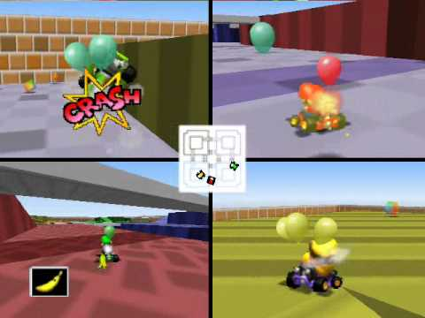

Since I was a child, I've been fascinated with the way that computers work. I recall being enamored with the [communicators](https://en.wikipedia.org/wiki/Communicator_(Star_Trek)) used in Star-Trek or dreaming over Dexter's secret laboratory from the [90's cartoon](https://en.wikipedia.org/wiki/Dexter%27s_Laboratory) of the same name.

As I entered my teens, my attention pivoted towards video games. While I raced around in Mario Kart 64, I couldn't help but wonder what was happening under the hood. I knew that computers were good at doing basic arithmetic, but *how* did simple arithmetic add up to create such vibrant worlds as those shown in the video games?


*Video games like Mario Kart 64 made me wonder how applications work under the hood.*

I dreamed of the countless lines of code that must be working in unison to orchestrate such a complex world. How were the engineers able to conduct all of those moving parts to create such a symphony? I couldn't imagine how on Earth they managed to make it all work. I *did* know that one day I would have to find out.

Fast forward a few years and countless projects later and I've learned so much about what makes software tick. I've written games, websites, apps, shells, and now this blog that you're reading! It's my hope that this blog inspires and helps aspiring software engineers to pursue their passion.

I can't thank you enough for joining me on this adventure. Cheers! 

```java
// Or, as they say in Java...
System.out.println("Hello, world! 🎉🍾🎊");
```
